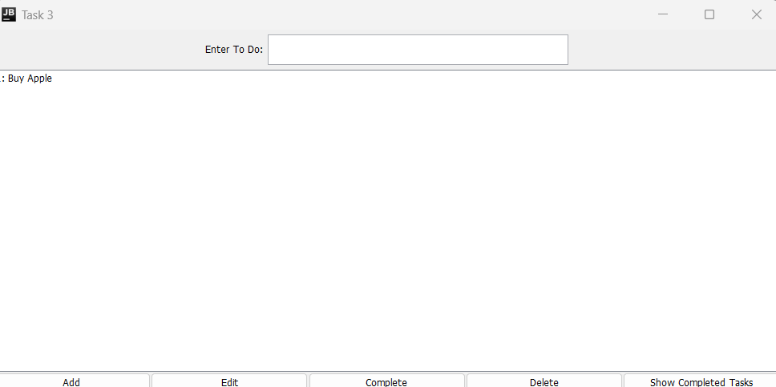

#  To-Do List Manager

## 📝 Description
**Task3** is a Java Swing application that functions as a To-Do List Manager. It provides users with the ability to add, edit, complete, delete, and view tasks. The application includes a feature to track completed tasks, allowing for better task management and productivity.

---

## 🚀 Features
- **Add Tasks**: Quickly add tasks to your to-do list.
- **Edit Tasks**: Update the description of existing tasks.
- **Mark as Complete**: Mark tasks as completed and move them to a separate list.
- **Delete Tasks**: Remove tasks that are no longer needed.
- **View Completed Tasks**: Display all completed tasks in a separate window.

---

## 🖥️ Technologies Used
- **Java Swing**: For building the graphical user interface.
- **Java Collections Framework**: To manage tasks and completed tasks.
- **Event Listeners**: For handling button actions and interactions.

---

## 📸 Screenshot


---

## 🛠️ How to Run
1. Clone this repository:
   ```bash
   git clone https://github.com/your-username/task3-todo-manager.git
   ```
2. Navigate to the project directory:
   ```bash
   cd task3-todo-manager
   ```
3. Compile the Java program:
   ```bash
   javac Task3.java
   ```
4. Run the application:
   ```bash
   java Task3
   ```

---

## 🧮 How to Use
1. **Add a Task**: 
   - Type a task description in the input field.
   - Click the **Add** button to add the task to the list.
2. **Edit a Task**:
   - Select a task from the list.
   - Type the new description in the input field.
   - Click the **Edit** button to save changes.
3. **Complete a Task**:
   - Select a task from the list.
   - Click the **Complete** button to move the task to the completed tasks list.
4. **Delete a Task**:
   - Select a task from the list.
   - Click the **Delete** button to remove it.
5. **View Completed Tasks**:
   - Click the **Show Completed Tasks** button to view all tasks marked as completed in a new window.

---

## 📂 Project Structure
```
.
├── Task3.java         # Main application file
├── README.md          # Project documentation
└── screenshot.png     # Screenshot of the application (to be added)
```

---
